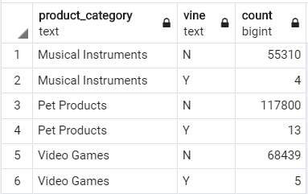
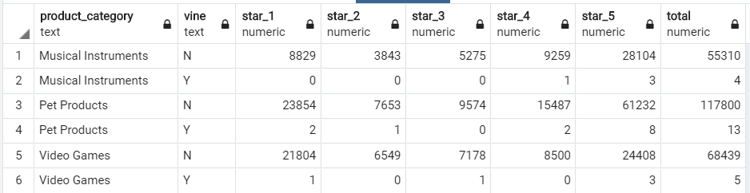
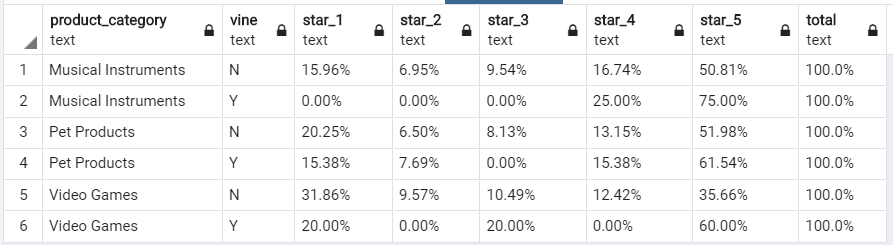

# Big-Data-Challenge / Cloud ETL: Amazon Review Bias
By A. Rijpkema, 3/31/2020

##This assignment covered 
* creating a remote AWS-RDS (database server)
* linking to that database using Postgres' PGAdmin tool
* applying ETL in the cloud through the use of Google's Colab and AWS-S3 buckets
* filling the database with the created dataframes 
* Analysing the data using SQL in PGAdmin

##The question at hand:
Many of Amazon's shoppers depend on product reviews to make a purchase. Amazon makes these datasets publicly available. These datasets are quite large and can easily exceed the capacity of local machines (over 40 datasets with over 1.5 million rows). Cloud ETL (using Google Colab) and remote databases (using Amazon's AWS) offer a solution here by letting you store your data and run your analysis remotely using their large server-network.
*Quesion:* Are reviews on Amazon's Vine program trustworthy?

Execution:
*Level 1 Steps*: 

Created S3 Bucket called [Amazon-review-bucket](https://s3.console.aws.amazon.com/s3/buckets/amazon-review-bucket/?region=us-east-1). 

Dataset used:
Pet Product Reviews (amazon_reviews_us_Pet_Products_v1_00.tsv.gz)
Musical Instrument Reviews (amazon_reviews_us_Musical_Instruments_v1_00.tsv.gz)
Video Game Reviews (extra - amazon_reviews_us_Video_Games_v1_00.tsv.gz)

Created a jupyter notebook (in Google's Colab) to retrieve the data, clean the data and subsequenty load Amazon review data into a Spark DataFrame. It dropped all reviews that didn't have purchase verification, that had no helpful votes and less then 5 votes total. Some data was aggregated (e.g. the total number of reviews per customer) and some columns had to have their associated datatype changed to fit the underlying database tables. See [Pet Product](level_1/pet_products_review_analysis.ipynb) and [Music Instruments](level_1/musical_instruments_review_analysis.ipynb)

Data was then saved to the remote database using RDS instance on AWS. 

Level 2: SQL was used to perform a statistical analysis of selected data.

A script was provided for creating the 4 required tables in Postgres (schema.sql). However, the product_category was not included in it, so a second script (called [after_schema.sql](level-l/after_schema.sql) was created to drop and recreate the products table to include this field. This way the output of both dataset can share tables. A view linking the 4 tables allows for easy querying and performing analysis. 

Output:

1. High level output: number of reviews per product category with a split between vine or regular reviews

2. The start rating of vine vs non vine reviewers is as follows. For one, there are very few vine reviewers compared to the total number of non vine reviewers. They rate as follows:

in percentages it becomes clear that vine reviewers rate much more positively and much less negatively than the overal reviewers on Amazon. THERE IS A CLEAR BIAS!

3. A look at helpful vs total reviews and average number of reviews per vine/non-vine reviewer reveils the following. Depending on the category, Vine reviewer receive more helpful views then regular reviewers. Especially in the case of Musical Instrument reviews. For video games it's the opposite. The average number of votes as well as the average number of helpful votes per review is higher for non-vine reviewers than vine reviewers (except for Pet Products, they are closer in average). REVIEWS BY VINE-REVIEWERS DOES NOT IMPACT A CUSTOMERS PERCEPTION OF THE REVIEW as they are rate less helpful than those that are not considered vine-reviewers.

4. In  an attempt to do a TTest on the data (which I saved back in a bucket on AWS) didn't quite work out. Project 3 has started, so I will continue to get that to work later. 
